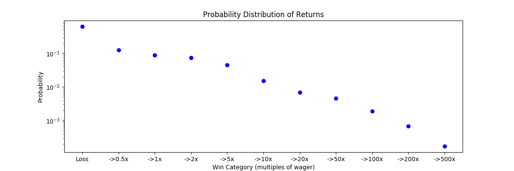
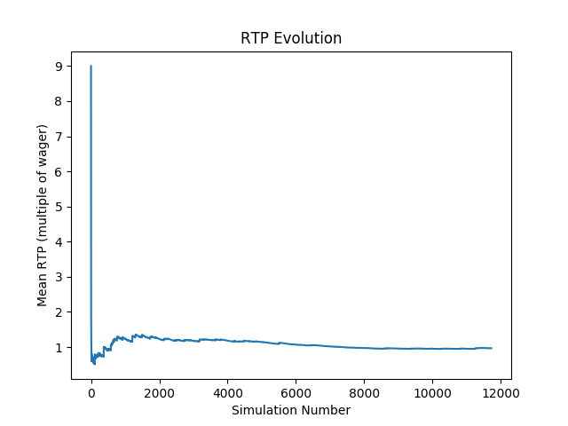

# Slotenium

This module allows one to automate playing demo (free play) versions of slot games using [Selenium](https://www.seleniumhq.org/). During each spin, the balance, wager, and winnings are recorded. Over many many spins, one can estimate the empirical probability distribution of the RTP, or "return to player". From this, one can calculate several metrics to compare the games and select one that suits a particular gambler's style.

A few notes:

* As of now, this only works with certain online slot games by [International Game Technology (IGT)](https://www.igt.com/). The next version will hopefully work on any game that uses an HTML5 canvas.

* You **cannot** use this app to play with real money, and this is purely for educational purposes.

* If you use this app frequently, your IP address might get banned from the website that serves the games (our intentions are good, but IGT probably doesn't want robots playing slots). I would therefore recommend using a [VPN](https://en.wikipedia.org/wiki/Virtual_private_network).

## How it Works

IGT has an RGS (remote game server) system that delivers their slot games to online casinos. When you press the spin button on a slot game, the browser communicates with a server that runs a random number generator (RNG) to compute the result. This outcome is then sent back to the browser displayed on the reels. We can't gain access to the RNG because it is run server-side, but we can try to reconstruct the probability distribution of returns by running many simulations.

Nowadays most of these games are built in HTML5 - which is great for browser automation tools like Selenium. We can load one of these games and use Selenium to identify the spin buttons, along with the wager, winnings, and balance fields. The `IGTSlotSession` class uses Selenium to spin the reels and extract information about the outcome from the relevant fields. When we are done with a session, the outcomes are saved in a CSV file.


## Installation

To install the requirements for Slotenium, use

```bash
pip install -r requirements.txt
```

I recommend creating a virtual environment so that the proper versions of each package are installed without any conflicts.


## Directory Structure

Below is a breakdown of the files in this repository.
<pre class="language-bash"><code class="language-bash">slotenium
|____assets          
| |____rtp_dist.png         # Probability distribution of RTP
| |____rtp_evol.png         # Evolution of RTP with number of simulations
|____igt_session.py         # Code for setting up IGT gambling session
|____requirements.txt       # required libraries for running all code in this directory
|____results
| |____siberian_storm       # directory with output of simulations
|____README.md              # this
|____analysis.py            # for plotting output of simulations and calculating statistics
|____play_game.py           # run simulations of an IGT game (Siberian Slots by default)
|____helpers.py             # helper functions for running simulations and analysis
</code></pre>

## Games

I have included five games in the file `helpers.py`, along with a function to construct the corresponding URL. All games can be fully automated (meaning no user interaction is required to play indefinitely, including through bonuses).

You can use [this Google search](https://www.google.com/search?q="m.ac.rgsgames.com") to find more games that are compatible with Slotenium. Note that some of them require user interaction during bonus rounds, or to proceed through some initial instructions, and will time out if unattended.

## Example: Siberian Storm

From [VegasSlotsOnline](https://www.vegasslotsonline.com/igt/siberian-storm/):

> IGT's Siberian Storm is a tiger or feline themed slot machine with 5-reels and 720 paylines. The color theme of the slot machine is white, matching the theme of the Siberian Tiger and the snow-filled regions that it is found in. Symbols used in the game include the mighty Siberian tiger, an orange tiger, a gold-plated claw of the tiger, the eye of the tiger, an emerald ring and the Siberian Storm logo among others.

> The game has a wild symbol, one with the white tiger and also a scatter symbol, which triggers the bonus features. Siberian Storm is a slot that belongs to the family for Fire Horse slots and has **an impressive payout percentage of around 96%.**

So we know that the payout percentage is about 96%. We would like to confirm this via our simulations.

Using the `IGTSlotSession` tool, I recorded 11718 games of Siberian Storm. This is not nearly enough to capture the full distribution of returns, which would require infinitely many spins, but it will at least give us a good sense of how wins tend to be distributed.

Below I produced a probability distribution for the returns, binned into groups representing a range of multiples of the wager.



The probability of losing is about 63.6%. This is comparable to the 20-line [Cleopatra slot machine](https://www.vegasslotsonline.com/igt/cleopatra/) (also by IGT), which lost 64.2% of the time over 10 million rounds of simulations (kudos to [Casino Guru](https://casino.guru/cleopatra-slot-math) for their analysis!)

### Average RTP

One can calculate an approximate average RTP for each game. Recall that for Siberian Storm, this was about 96%. I obtained 96.64% (see `analysis.py`) - which is pretty close to the expected value! Below we can see how the average RTP evolves with the number of winnings. The y-axis represents the return as a multiple of the wager.



### Volatility

Two games with the same average RTP can have very different probability distributions. Low volatility games tend to produce wins more frequently, but the average return per win tends to be smaller. To capture these differences, the average RTP can be decoupled into two measures: the **average RTP per win** (RTPW); and the probability of winning. The product of these gives the average RTP. Low volatility games shift more weight onto the probability of winning, while high volatility games shift more weight onto the average RTPW.

For Siberian Storm, the average RTPW is about **2.66 times the wager**. You arrive at this measure by dividing the average RTP (0.9664) by the probability of winning (0.364). This is a medium-low volatility game, just like 20-line Cleopatra. Compare this to 1-line Cleopatra, which has an RTP of 95.02% but only an [11.3% chance of a hit](https://casino.guru/cleopatra-slot-math). This corresponds to an RTPW of 8.4!